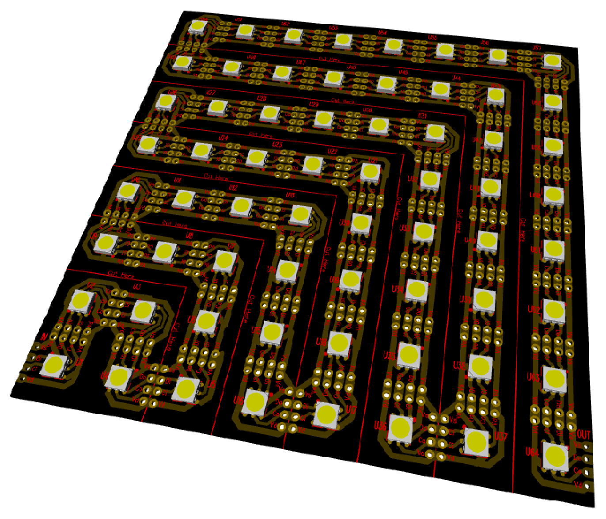
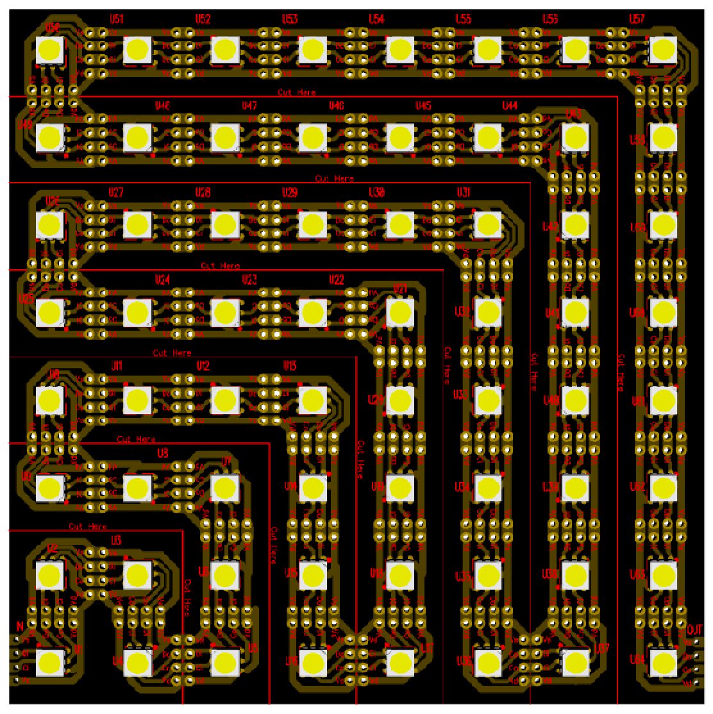
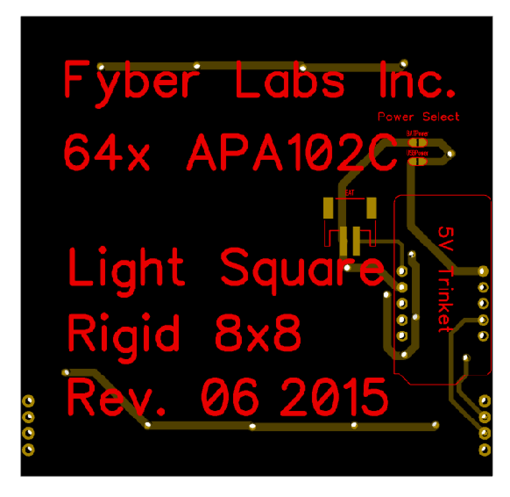

[Fyber Labs](https://www.fyberlabs.com) 64x APA102(C)
========

This is the hardware design repository for 64x Light Square panels from Fyber Labs.  
For more information on design progress, please see [the hackaday page](https://hackaday.io/project/5867-light-square).  

There are 2 main variations rigid and 16mm flexible PCB.

[The 16mm flexible is now available on Indiegogo.](https://www.indiegogo.com/projects/fyber-labs-light-square-flexible-rgb-led-panel/x/10833462#/story)
The 16mm flexible PCB is a 5" square flexible panel that can be used in costumes and fashion.

The rigid is a small 8x8 panel of LED meant to be fabricated on a regular rigid PCB.  We well
sell this soon on Tindie and it includes the ability to mount an [Adafruit Trinket](https://www.adafruit.com/products/1509) for
easy control of 1 or more panels.

General schematic for the panels:

This project is an accessory concept from the [Flex Modules](https://hackaday.io/project/2236-flex-modules) being developed
for general wearable designs.

